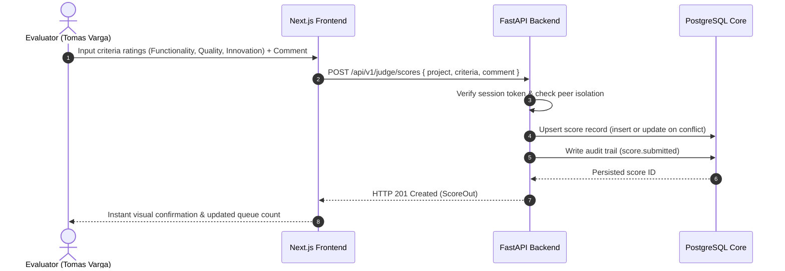
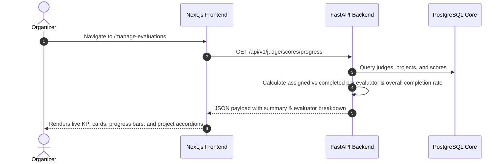

# DOGFOOD System Architecture

## 1. System Overview

DOGFOOD is an autonomous, self-contained hackathon evaluation and management platform engineered for high-stakes in-person and distributed hackathons. It operates as an offline appliance inside a single container on port `8080`, providing:

1. **Autonomous Offline Appliance**: Zero external SaaS dependencies, zero CDN reliance, and local font/asset delivery.
2. **Zero-Trust Peer Isolation**: Evaluators grade submissions blindly without visibility into competitor scores or peer reviews.
3. **Empirical Bayes Variance Calibration**: Normalizes evaluator harshness and leniency toward a true Bayesian posterior mean.
4. **Role-Based Access Control (RBAC)**: Fine-grained access separation across Admin, Organizer, Judge, and Participant roles.
5. **Real-Time Dynamic Monitoring**: Live database-driven Judge Evaluation Progress console with queue bottleneck tracking.

```
                          ┌─────────────────────────────┐
                          │   Client Browser (Port 8080) │
                          └──────────────┬──────────────┘
                                         │ HTTP
                                         ▼
┌─────────────────────────────────────────────────────────────────────────────┐
│                          DOGFOOD Docker Appliance (8080)                     │
│                                                                             │
│  ┌───────────────────────────┐           ┌────────────────────────────────┐ │
│  │   Next.js 16 (App Router) │           │   FastAPI Asynchronous Backend │ │
│  │   - React 19 Client UI    │  Reverse  │   - OAuth2 / Bearer & Sessions │ │
│  │   - Tailwind & Design Sys │  Proxy    │   - Peer Isolation Guard       │ │
│  │   - Port 8080 Web Server  │ ────────> │   - Bayes Calibration Engine   │ │
│  │   - Route Handlers        │           │   - Port 8000 Internal         │ │
│  └───────────────────────────┘           └───────────────┬────────────────┘ │
│                                                          │ SQLAlchemy       │
│                                                          ▼                  │
│                                          ┌────────────────────────────────┐ │
│                                          │      Local PostgreSQL 15       │ │
│                                          │   - Persistent Schema          │ │
│                                          │   - Auto-seeded Fixtures       │ │
│                                          └────────────────────────────────┘ │
└─────────────────────────────────────────────────────────────────────────────┘
```

---

## 2. Component Topology

### 2.1 Next.js 16 Gateway & Frontend
- **Framework**: Next.js 16 with Turbopack and React 19.
- **Port**: Serves all public and authenticated user traffic on port `8080`.
- **API Proxy**: Uses Next.js internal rewrites and API route routing to transparently forward `/api/v1/*` requests to the internal FastAPI backend (`http://127.0.0.1:8000`).
- **Design System**: Strict light-themed CSS tokens defined in `globals.css` with smooth micro-interactions, responsive sidebars, and fluid typography.

### 2.2 FastAPI Asynchronous Backend
- **Framework**: FastAPI (Python 3.11+).
- **Internal Port**: Runs on `127.0.0.1:8000` inside the container boundary.
- **Authentication**: Dual-mode auth supporting `Authorization: Bearer <token>` and `session=<cookie>` headers.
- **Zero-Trust Barrier**: Verified via middleware and dependency injection (`require_auth`, `require_judge`, `require_organizer`, `require_admin`).

### 2.3 PostgreSQL 15 Relational Core
- **Database Engine**: PostgreSQL 15 initialized on startup.
- **Security**: Runs under least-privilege non-superuser role `dogfood`.
- **ORM / Query Layer**: SQLAlchemy Core and Async sessions.

---

## 3. Security Architecture & Threat Models

### 3.1 Zero-Trust Peer Isolation Barrier
In traditional hackathons, judges often look at leaderboards or discuss evaluations prematurely, introducing anchoring bias and collusion. DOGFOOD enforces:
- **Blind Evaluation**: When a judge queries `GET /api/v1/judge/scores`, the database only returns score records where `scores.judge == authenticated_judge_id`.
- **Cross-Inspection Denial**: If an evaluator attempts to query `GET /api/v1/judge/scores?judge=other_judge`, the system throws `HTTP 403 Forbidden` (`PeerIsolationViolationException`).
- **Audit Logging**: Any illegal peer-access attempts are logged into the immutable `audit_logs` table.

### 3.2 Organizer & Admin Oversight
- Organizers and Admins have permission to view aggregated metrics and all score records via `is_organizer=True` checks.
- When an organizer requests `GET /api/v1/judge/scores/progress`, the backend performs an aggregated join across `judges`, `projects`, and `scores` to compute real-time queue completion rates without exposing raw judge notes to competitor teams.

---

## 4. Data Flow Pipelines

### 4.1 Evaluation Submission Lifecycle


### 4.2 Dynamic Progress Monitoring


---

## 5. Offline Appliance Compliance

DOGFOOD complies with strict zero-network competition environments:
1. **Fonts & Assets**: Embedded SVG icon libraries (`lucide-react`) and standard system typography stacks without external Google Font requests.
2. **Dependencies**: All Node modules and Python packages are cached within the Docker image layers.
3. **No External OAuth**: Native self-contained password hashing (`bcrypt`) and session token generator.
