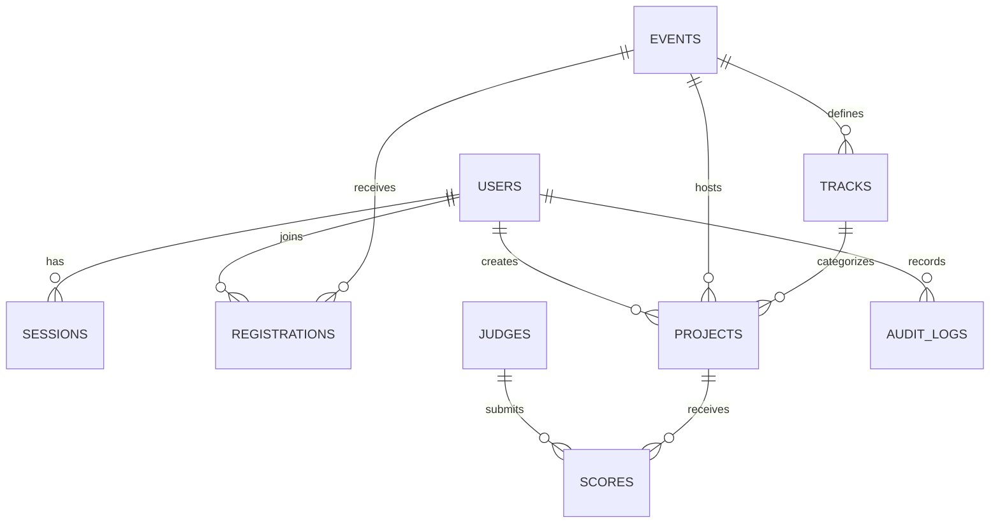

# DOGFOOD Database Schema Reference

DOGFOOD uses PostgreSQL 15 as its relational database core.

---

## 1. Entity Relationship Diagram

---

## 2. Table Specifications

### 2.1 `users`
Stores user identities, hashed credentials, and role privileges.

| Column | Type | Constraints | Description |
|:---|:---|:---|:---|
| `id` | VARCHAR(64) | PRIMARY KEY | Unique user ID (e.g. `org_01`, `jdg_01`) |
| `email` | VARCHAR(255) | UNIQUE, NOT NULL | Account email address |
| `name` | VARCHAR(255) | NOT NULL | Display name |
| `role` | VARCHAR(32) | NOT NULL | Role: `admin`, `organizer`, `judge`, `participant` |
| `avatar_url` | VARCHAR(512) | NULLABLE | Avatar URL |
| `bio` | TEXT | NULLABLE | User biography |
| `github_handle` | VARCHAR(64) | NULLABLE | GitHub profile handle |
| `hashed_password` | VARCHAR(255) | NOT NULL | Bcrypt password hash |
| `created_at` | TIMESTAMPTZ | DEFAULT now() | Registration timestamp |

### 2.2 `sessions`
Tracks active bearer tokens and session cookies.

| Column | Type | Constraints | Description |
|:---|:---|:---|:---|
| `token` | VARCHAR(128) | PRIMARY KEY | Bearer token / cookie value |
| `user_id` | VARCHAR(64) | FOREIGN KEY (users.id) | Associated user |
| `expires_at` | TIMESTAMPTZ | NOT NULL | Session expiry timestamp |
| `created_at` | TIMESTAMPTZ | DEFAULT now() | Session start timestamp |

### 2.3 `events` (Hackathons)
Defines competitions and lifecycle rules.

| Column | Type | Constraints | Description |
|:---|:---|:---|:---|
| `id` | VARCHAR(64) | PRIMARY KEY | Event ID (e.g. `evt_01`) |
| `slug` | VARCHAR(128) | UNIQUE, INDEX | URL slug |
| `name` | VARCHAR(255) | NOT NULL | Event title |
| `description` | TEXT | NULLABLE | Detailed description |
| `start_date` | TIMESTAMPTZ | NOT NULL | Hackathon start time |
| `submissions_close`| TIMESTAMPTZ | NOT NULL | Deadline after which submissions are rejected |
| `status` | VARCHAR(32) | DEFAULT 'open'| Status: `upcoming`, `open`, `evaluating`, `completed` |
| `prizes` | JSON | NULLABLE | Prize pool breakdown |
| `created_at` | TIMESTAMPTZ | DEFAULT now() | Creation timestamp |

### 2.4 `tracks`
Event tracks and categories.

| Column | Type | Constraints | Description |
|:---|:---|:---|:---|
| `id` | VARCHAR(64) | PRIMARY KEY | Track ID (e.g. `trk_01`) |
| `event_id` | VARCHAR(64) | INDEX | Foreign event key |
| `name` | VARCHAR(128) | NOT NULL | Track title (e.g. "Developer Tools") |
| `description` | TEXT | NULLABLE | Track problem statement |

### 2.5 `judges`
Evaluator registry and assigned tracks.

| Column | Type | Constraints | Description |
|:---|:---|:---|:---|
| `id` | VARCHAR(64) | PRIMARY KEY | Judge ID |
| `name` | VARCHAR(255) | NOT NULL | Evaluator full name |
| `email` | VARCHAR(255) | NOT NULL | Evaluator email |
| `tracks` | JSON | NOT NULL | List of assigned track IDs or names |

### 2.6 `projects`
Hackathon codebase submissions.

| Column | Type | Constraints | Description |
|:---|:---|:---|:---|
| `id` | VARCHAR(64) | PRIMARY KEY | Project ID (e.g. `proj_01`) |
| `slug` | VARCHAR(128) | INDEX | URL slug |
| `event_id` | VARCHAR(64) | INDEX | Associated hackathon |
| `team` | VARCHAR(64) | NOT NULL | Submitting team name |
| `user_id` | VARCHAR(64) | INDEX | Submitter user ID |
| `track` | VARCHAR(64) | NOT NULL | Track ID |
| `track_label` | VARCHAR(128) | NULLABLE | Human-readable track name |
| `title` | VARCHAR(255) | NOT NULL | Project title |
| `summary` | TEXT | NULLABLE | Executive summary |
| `repo_url` | VARCHAR(512) | NULLABLE | Source code repository |
| `demo_url` | VARCHAR(512) | NULLABLE | Live demo link |
| `likes_count` | INTEGER | DEFAULT 0 | Community upvotes |
| `status` | VARCHAR(32) | DEFAULT 'submitted'| Status |
| `submitted_at` | TIMESTAMPTZ | NOT NULL | Submission timestamp |

### 2.7 `scores`
Independent evaluation records.

| Column | Type | Constraints | Description |
|:---|:---|:---|:---|
| `id` | SERIAL | PRIMARY KEY | Auto-incrementing score ID |
| `judge` | VARCHAR(64) | NOT NULL | Evaluator ID |
| `project` | VARCHAR(64) | NOT NULL | Evaluated project ID |
| `criteria` | JSON | NOT NULL | Ratings object: `{"functionality": 9.0, ...}` |
| `comment` | TEXT | NULLABLE | Evaluator qualitative critique |
| `created_at` | TIMESTAMPTZ | DEFAULT now() | Evaluation submission timestamp |

*Note*: An upsert constraint ensures that when a judge re-submits a score for the same project, the existing record is updated in-place.

### 2.8 `audit_logs`
Immutable audit trail for all critical security and governance actions.

| Column | Type | Constraints | Description |
|:---|:---|:---|:---|
| `id` | SERIAL | PRIMARY KEY | Log ID |
| `user_id` | VARCHAR(64) | NOT NULL | Actor ID |
| `action` | VARCHAR(128) | NOT NULL | Action (e.g. `score.submitted`, `judge.auto_assign`) |
| `details` | JSON | NULLABLE | Action metadata and contextual payload |
| `created_at` | TIMESTAMPTZ | DEFAULT now() | Log timestamp |
